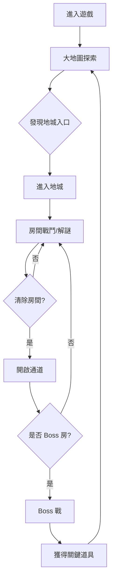
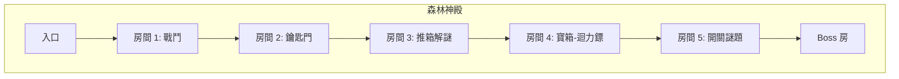

# 01 - 產品規格書

## 遊戲概要

### 類型
2D 俯視角動作冒險 RPG (Zelda-like ARPG)

### 目標玩家
- 喜歡經典薩爾達系列的玩家
- 偏好短時遊玩、探索解謎的手遊用戶
- 年齡層：12+

### 遊玩時長
- 單次遊玩：15-30 分鐘
- 完整通關：2-4 小時 (MVP)

---

## 核心遊戲循環



---

## 操作設計

### 虛擬搖桿 (Mobile)
| 元件 | 位置 | 功能 |
|------|------|------|
| 移動搖桿 | 左下角 | 8 方向移動 |
| 攻擊按鈕 | 右下角 | 揮劍攻擊 |
| 道具按鈕 | 右側 | 使用當前裝備道具 |
| 選單按鈕 | 右上角 | 開啟道具選單 |

### 按鍵對應 (Debug/PC)
| 按鍵 | 功能 |
|------|------|
| WASD / 方向鍵 | 移動 |
| J / Space | 攻擊 |
| K | 使用道具 |
| I | 開啟背包 |
| ESC | 暫停選單 |

---

## 角色設計

### 玩家角色
| 屬性 | 初始值 | 說明 |
|------|--------|------|
| HP | 6 (3 心) | 每心 = 2 HP |
| 移動速度 | 200 px/s | 可升級 |
| 攻擊力 | 1 | 依武器變化 |
| 無敵時間 | 1.0 秒 | 受傷後無敵 |
| 擊退距離 | 50 px | 受傷擊退 |

### 敵人類型 (MVP)
| 敵人 ID | 名稱 | HP | 攻擊力 | 行為 |
|---------|------|-----|--------|------|
| `slime` | 史萊姆 | 2 | 1 | 隨機移動 |
| `skeleton` | 骷髏兵 | 4 | 2 | 追擊玩家 |
| `bat` | 蝙蝠 | 1 | 1 | 飛行+衝撞 |

---

## 道具系統

### 消耗品
| 道具 ID | 名稱 | 效果 | 堆疊上限 |
|---------|------|------|----------|
| `key` | 小鑰匙 | 開啟鎖住的門 | 9 |
| `bomb` | 炸彈 | 炸開可破壞牆壁 | 9 |
| `heart` | 愛心 | 回復 2 HP | - (立即使用) |

### 裝備道具
| 道具 ID | 名稱 | 效果 | 取得方式 |
|---------|------|------|----------|
| `sword_wood` | 木劍 | 攻擊力 1 | 初始裝備 |
| `boomerang` | 迴力鏢 | 暈眩敵人 + 觸發開關 | 地城 1 寶箱 |
| `bow` | 弓箭 | 遠程攻擊 | 地城 2 寶箱 |

---

## 世界設計

### 場景列表
| 場景 ID | 名稱 | 類型 | 說明 |
|---------|------|------|------|
| `boot` | 啟動畫面 | System | 載入資源 |
| `mainMenu` | 主選單 | UI | 開始/繼續/設定 |
| `overworld` | 大地圖 | Gameplay | 探索區域 |
| `dungeon_01` | 森林神殿 | Gameplay | 第一個地城 |

### 大地圖區域 (MVP)
```
┌─────────────────────────────────────┐
│           [北方森林]                 │
│              ▲                       │
│              │                       │
│ [西方洞窟] ◀─┼─▶ [村莊] ◀─▶ [東方海岸] │
│              │                       │
│              ▼                       │
│         [南方沙漠]                   │
└─────────────────────────────────────┘
```

### 地城結構


---

## 解謎機制

### 觸發器類型
| Trigger ID | 名稱 | 行為 |
|------------|------|------|
| `pressure_plate` | 壓力板 | 站上觸發/離開解除 |
| `switch` | 開關 | 攻擊切換狀態 |
| `torch` | 火把 | 用火點燃 |
| `bombable_wall` | 可炸牆 | 炸彈摧毀 |
| `chest` | 寶箱 | 開啟獲得道具 |

### 門類型
| Door ID | 名稱 | 開啟條件 |
|---------|------|----------|
| `normal` | 一般門 | 靠近自動開啟 |
| `locked` | 鎖住的門 | 消耗 1 鑰匙 |
| `boss` | Boss 門 | 需要 Boss 鑰匙 |
| `combat` | 戰鬥門 | 清除房間敵人 |

---

## 存檔系統

### 存檔內容
```typescript
interface SaveData {
  version: string;           // Schema 版本
  timestamp: number;         // 存檔時間戳
  player: {
    hp: number;
    maxHp: number;
    position: { x: number; y: number };
    currentRoom: string;
  };
  inventory: {
    items: Record<string, number>;  // itemId -> count
    equipment: string[];            // 已裝備道具 ID
  };
  world: {
    chestsOpened: string[];         // 已開啟寶箱 ID
    doorsUnlocked: string[];        // 已解鎖門 ID
    enemiesCleared: string[];       // 已清除敵人群組 ID
  };
  dungeon: {
    currentDungeon: string | null;
    roomsCleared: string[];
    bossDefeated: boolean;
  };
}
```

### 存檔觸發點
- 進入新房間時自動存檔
- 開啟寶箱後存檔
- 手動存檔點

---

## UI 設計

### HUD 元素
```
┌────────────────────────────────────────┐
│ ❤️❤️❤️      [Key] x3    [Bomb] x5       │
│                                        │
│                                        │
│            [遊戲畫面]                   │
│                                        │
│                                        │
│ [搖桿]              [道具] [攻擊]       │
└────────────────────────────────────────┘
```

### 選單層級
```
主選單
├── 開始遊戲
├── 繼續遊戲
├── 設定
│   ├── 音量
│   ├── 語言
│   └── 觸控靈敏度
└── 製作人員
```

---

## 音效設計 (規劃)

### 音效列表
| ID | 用途 | 觸發時機 |
|----|------|----------|
| `sfx_sword_swing` | 揮劍 | 攻擊動作 |
| `sfx_hit_enemy` | 擊中敵人 | 造成傷害 |
| `sfx_player_hurt` | 玩家受傷 | 受到傷害 |
| `sfx_door_open` | 開門 | 門解鎖 |
| `sfx_chest_open` | 開寶箱 | 互動寶箱 |
| `sfx_item_get` | 獲得道具 | 拾取道具 |

### BGM 列表
| ID | 場景 |
|----|------|
| `bgm_title` | 主選單 |
| `bgm_overworld` | 大地圖 |
| `bgm_dungeon` | 地城 |
| `bgm_boss` | Boss 戰 |

---

*文件版本: 1.0*
*創建日期: 2026-01-18*
