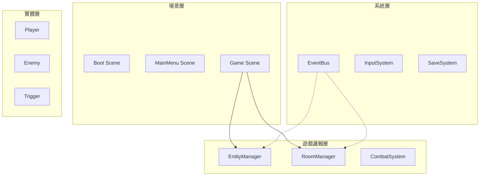
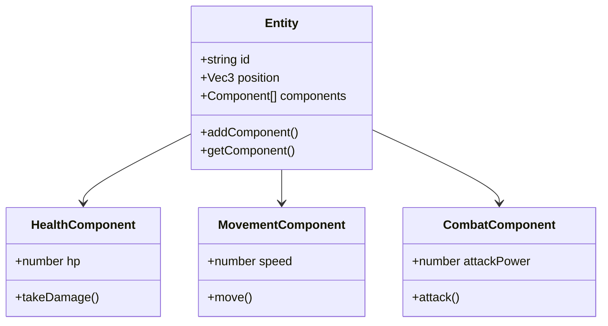
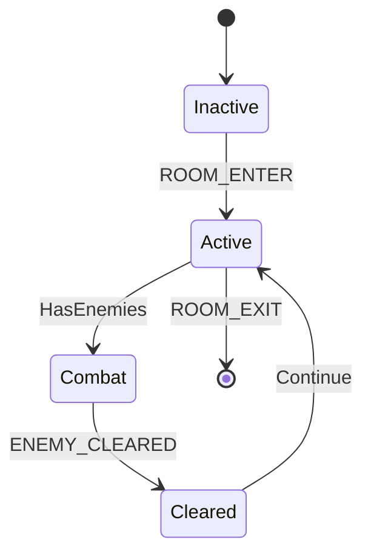

# 02 - 技術架構

## 整體架構圖



## 核心事件定義

| Event Name | Payload | 觸發時機 |
|------------|---------|----------|
| `ROOM_ENTER` | `{ roomId }` | 進入新房間 |
| `ENEMY_DEATH` | `{ enemyId }` | 敵人死亡 |
| `ENEMY_CLEARED` | `{ roomId }` | 房間敵人全滅 |
| `PLAYER_HURT` | `{ damage }` | 玩家受傷 |
| `SWITCH_ON` | `{ triggerId }` | 開關開啟 |
| `DOOR_OPEN` | `{ doorId }` | 門開啟 |
| `CHEST_OPENED` | `{ chestId, itemId }` | 寶箱開啟 |

## Entity-Component 架構



## Room 狀態機



## 目錄結構

```
assets/scripts/
├── core/           # EventBus, ObjectPool, Entity, Component
├── systems/        # Input, Audio, Save, UI
├── gameplay/
│   ├── entity/     # Player, Enemy, Projectile
│   ├── components/ # Health, Movement, Combat, AI
│   └── world/      # Room, Door, Chest, Triggers
└── ui/             # HUD, VirtualJoystick, Menus
```

## 效能優化策略

1. **物件池** - 子彈、特效、敵人使用 ObjectPool
2. **避免 GC** - 重用陣列，避免每幀 new
3. **分幀載入** - 進入房間時分幀生成敵人
4. **碰撞優化** - Grid-based 空間分割

## Debug Panel

| 功能 | 快捷鍵 | 說明 |
|------|--------|------|
| God Mode | G | 無敵 |
| Add Item | I | 新增道具 |
| Jump Room | R | 跳轉房間 |
| Kill All | K | 清敵人 |

---
*文件版本: 1.0*
